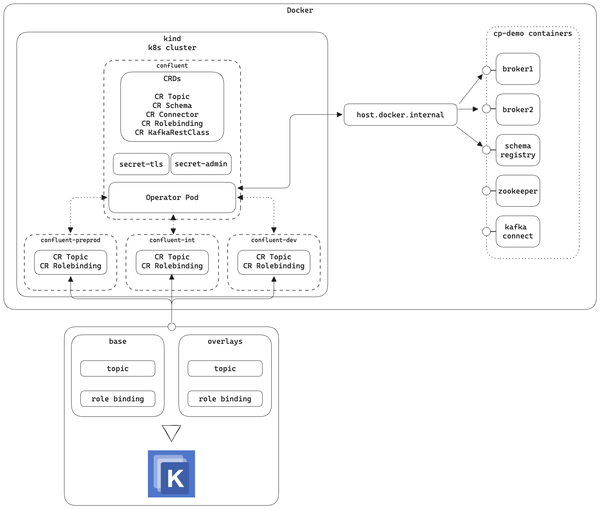
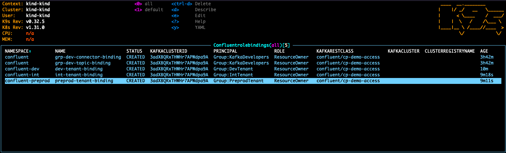
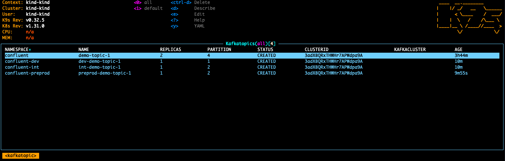

# Goal

Using [cp-demo](https://docs.confluent.io/platform/current/tutorials/cp-demo/docs/overview.html) we will create a topic,
schema and give permissions to an user.

## Diagram



## Pre-requisites

- Install kind (<https://kind.sigs.k8s.io/docs/user/quick-start/#installation>)
- Install helm (<https://helm.sh/docs/intro/install/>)
- Install kubectl (<https://kubernetes.io/docs/tasks/tools/>)
- Install docker, jq, docker-compose

## Start CP-demo

In order to make this example easier to start, please use the shell script to quickly start cp-demo. We will not
enter into details about CP-demo, in short, it is very useful to test Confluent Platform capabilities.

```shell
./start-cp-demo.sh
```

## Launch the k8s cluster

Start the kubernetes cluster

```shell
./start-k8s.sh
```

Install the CfK operator. Here we assume that each team has their own namespace, in which they will define their custom
resources.

To ensure that the operator will monitor other namespaces there are two possible configurations.

1. Use `--set namespaced=false`. This will monitor all namespaces.
2. Use `--set namespaced=true`. In addition, provide a list of the namespaces to monitor
   using `--set namespaceList="{namespace-1,namespace-2}"`.

In this example we follow the second approach.

```shell
kubectl create namespace confluent-int
kubectl create namespace confluent-dev
kubectl create namespace confluent-preprod
kubectl create namespace confluent
kubectl config set-context --current --namespace confluent

helm repo add confluentinc https://packages.confluent.io/helm --insecure-skip-tls-verify
helm repo update

helm upgrade --install confluent-operator confluentinc/confluent-for-kubernetes --namespace confluent --set debug="true" --set namespaced=true --set namespaceList="{confluent-int,confluent-dev,confluent-preprod,confluent}" 

kubectl get pods -A -o wide 
```

Create the bearer secret as superUser. This will be used by the CFK operator to log in the Metadata Service.

```shell
kubectl create secret generic cp-demo-credential \
     --from-file=bearer.txt=./data/bearer.txt \
     --namespace confluent
```

Create the tls configuration. This is required as cp-demo only allows secure connections to its brokers.

```shell
kubectl create secret generic cp-demo-tls \
    --from-file=tls.crt=./cp-demo/scripts/security/kafka2.certificate.pem \
    --from-file=ca.crt=./cp-demo/scripts/security/snakeoil-ca-1.crt \
    --from-file=tls.key=./cp-demo/scripts/security/snakeoil-ca-1.key \
    --namespace confluent
````

## Create the resources

This creates a custom resource that will be referenced by the kafka resources we want to create. This resource includes
_instructions_ for how the operator should connect to the cluster.
More specifically, it defines the host and port that the MDS listens to. In addition, the previously created bearer
secret and TLS credentials are referenced.

```shell
kubectl apply -f data/cp-demo-access.yml
```

This will create a topic and its schema. To define the schema a configMap must be created. The configMap holds the
information of how the schema looks like. These resources are defined in the `confluent` namespace.

```shell
kubectl apply -f data/cp-demo-resources.yml
```

This will create some role bindings required for **alice** and the connector to have access to the `demo-topic-1`. The
role bindings are defined in the `confluent` namespace.

```shell
kubectl apply -f data/group-developers-binding.yml
```

If the resources for each tenant are not present go ahead and create them

```shell
kustomize build data/overlays/tenant-dev > data/overlays/tenant-dev/tenant-resources.yaml
kustomize build data/overlays/tenant-int > data/overlays/tenant-int/tenant-resources.yaml
kustomize build data/overlays/tenant-preprod > data/overlays/tenant-preprod/tenant-resources.yaml
```

This will create a topic prefixed with `dev-` and the according role binding so only users belonging to the `DevTenant`
group can write to/read from the topic. These resources are defined in the `confluent-dev` namespace.

```shell
kubectl apply -f data/overlays/tenant-dev/tenant-resources.yaml
```

This will create a topic prefixed with `int-` and the according role binding so only users belonging to the `IntTenant`
group can write to/read from the topic. These resources are defined in the `confluent-int` namespace.

```shell
kubectl apply -f data/overlays/tenant-int/tenant-resources.yaml
```

This will create a topic prefixed with `preprod-` and the according role binding so only users belonging to
the `PreprodTenant` group can write to/read from the topic. These resources are defined in the `confluent-preprod`
namespace.

```shell
kubectl apply -f data/overlays/tenant-preprod/tenant-resources.yaml
```

### Delete If needed

```shell
kubectl delete -f data/overlays/tenant-dev/tenant-resources.yaml
```

```shell
kubectl delete -f data/overlays/tenant-int/tenant-resources.yaml
```

```shell
kubectl delete -f data/overlays/tenant-preprod/tenant-resources.yaml
```

```shell
kubectl delete -f data/cp-demo-access.yml
```

```shell
kubectl delete -f data/cp-demo-resources.yml
```

```shell
kubectl delete -f data/group-developers-binding.yml
```

## Check on control center

> Go to <http://localhost:9021>

| User      | Password        | User can see topics                                                                     |
|-----------|-----------------|-----------------------------------------------------------------------------------------|
| superUser | superUser       | `demo-topic-1`<br/>`dev-demo-topic-1`<br/>`int-demo-topic-1`<br/>`preprod-demo-topic-1` |
| alice     | alice-secret    | `demo-topic-1`                                                                          |
| devora    | devora-secret   | `dev-demo-topic-1`                                                                      |
| intela    | intela-secret   | `int-demo-topic-1`                                                                      |
| preprona  | preprona-secret | `preprod-demo-topic-1`                                                                  |

## Via CLI

See the topics that each user has access to

```shell
set CLUSTER_ID $(curl --silent --user superUser:superUser https://localhost:8091/kafka/v3/clusters/ --insecure | jq -r ".data[0].cluster_id")
#CLUSTER_ID=curl --silent --user superUser:superUser https://localhost:8091/kafka/v3/clusters/ --insecure | jq -r ".data[0].cluster_id"
echo "Cluster id: $CLUSTER_ID"
echo "Topics for superUser"
curl --silent --user superUser:superUser https://localhost:8091/kafka/v3/clusters/$CLUSTER_ID/topics --insecure |  jq '.data[] | select(.topic_name | startswith("_") | not) | .topic_name'
echo "Topics for alice"
curl --silent --user alice:alice-secret https://localhost:8091/kafka/v3/clusters/$CLUSTER_ID/topics --insecure |  jq '.data[] | select(.topic_name | startswith("_") | not) | .topic_name'
echo "Topics for devora"
curl --silent --user devora:devora-secret https://localhost:8091/kafka/v3/clusters/$CLUSTER_ID/topics --insecure |  jq '.data[] | select(.topic_name | startswith("_") | not) | .topic_name'
echo "Topics for intela"
curl --silent --user intela:intela-secret https://localhost:8091/kafka/v3/clusters/$CLUSTER_ID/topics --insecure |  jq '.data[] | select(.topic_name | startswith("_") | not) | .topic_name'
echo "Topics for preprona"
curl --silent --user preprona:preprona-secret https://localhost:8091/kafka/v3/clusters/$CLUSTER_ID/topics --insecure |  jq '.data[] | select(.topic_name | startswith("_") | not) | .topic_name'
```

Log in

```shell
confluent login --url https://localhost:8091 --ca-cert-path cp-demo/scripts/security/snakeoil-ca-1.crt
```

See the role bindings

```shell
confluent iam rbac role-binding list --kafka-cluster $CLUSTER_ID --principal Group:KafkaDevelopers 
echo ""
confluent iam rbac role-binding list --kafka-cluster $CLUSTER_ID --principal Group:DevTenant 
echo ""
confluent iam rbac role-binding list --kafka-cluster $CLUSTER_ID --principal Group:IntTenant 
echo ""
confluent iam rbac role-binding list --kafka-cluster $CLUSTER_ID --principal Group:PreprodTenant 
```

## K9S View

### Role bindings per namespace



### Kafka topics per namespace



## How to create custom resources for the existing resources

CFK does not offer an automated way to do this migration, yet. We can take a look how this could be done using the REST API and some scripting

Run the `create-custom-resources` script to get a yaml file that will contain the topic configurations.

```shell
./create-custom-resources.sh
```

## Shutdown

```shell
./stop-all.sh
```
